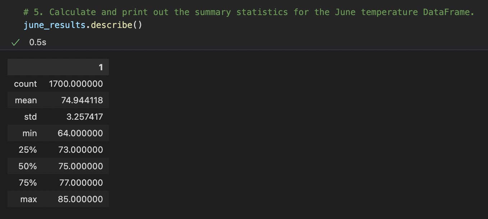
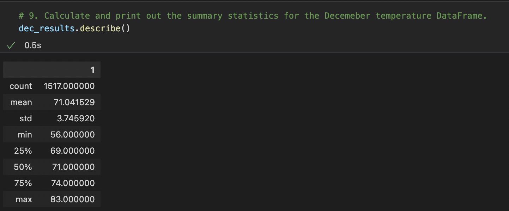

# surfs_up

## Resources
- hawaii.sqlite
- SurfsUp_Challenge.ipynb
--------------
- Python
- Jupyter Notebook
- SQLite (SQLAlchemy)

## Overview of the analysis:
Using Python, Pandas functions and methods, and SQLAlchemy, we can filter the date column of the Measurements table in the hawaii.sqlite database to retrieve all the temperatures for the month of June. We then convert those temperatures to a list, create a DataFrame from the list, and generate the summary statistics. 

## Results:
- The first step in providing the temperatures for the analysis is to setup the engine for the sqlite database.
- When we get the engine setup we are able to query the temps filtered using the extract function for the month of June.
- From the query we can make the object a list and then a DataFrame to allow us to get the decription of the dataframe. 

- Here we see the summary statistics for the first section describing the average temperatures for June.

- Here we see the summary statistics for the first section describing the average temperatures for December.

## Summary:
We wanted temperature data for the months of June and December in Oahu, in order to determine if the surf and ice cream shop business is sustainable year-round. From the images, we can see that the averages for both months were around a very nice 74.9 and 71.0. We should also be thinking about the low temp which only hit lows of 64 and 56. If we are trying to make sure that our Surf and ice cream business is going to work we should also pull the precipitation results to avoid any rain. Another Query that would aid in the description would be to pull up the nearest stations to the proposed location of the shop.
